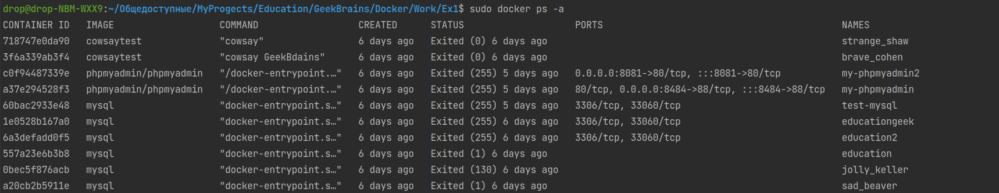
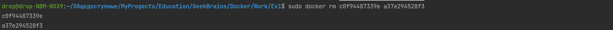
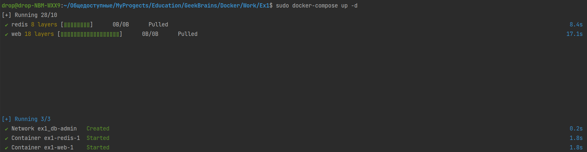
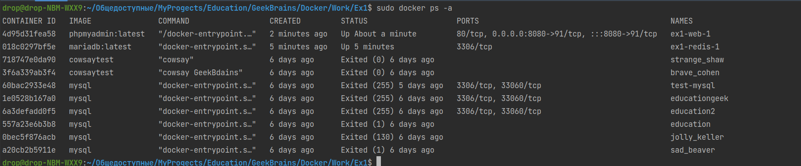
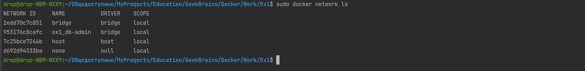
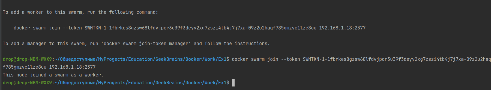
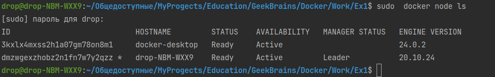

# Задача 1
1) создать сервис, состоящий из 2 различных контейнеров: 1 - веб, 2 - БД
2) далее необходимо создать 3 сервиса в каждом окружении (dev, prod, lab)
3) по итогу на каждой ноде должно быть по 2 работающих контейнера
4) выводы зафиксировать

Проверяю есть ли у меня контейнеры, которыйе я хочу создать
        
    sudo docker ps -a

Удаляю те, которые есть

    sudo docker rm c0f94487339e a37e294528f3

Запускаю докер контейнеры и связываю их одной командой

    sudo docker-compose up -d    

### Админка открывается, все отлично!

**Проверяем**

#### Курс по докеру
        https://www.youtube.com/watch?v=dNS61T4MmlM&list=PL0lO_mIqDDFX1c0JHogP5YuZdOVawoepS

#### Инициализирую  docker swarm

         sudo docker swarm init

### Смотрю мои ноды
    sudo  docker node ls

# У МЕНЯ УБУНТУ, НЕ ЗНАЮ КАК ПРИСОЕДЕНИТЬ ВТОРУЮ МАШИНУ НА ЛИНУКСЕ 
Вообщем команды приложил в файлике [command.sh](command.sh)